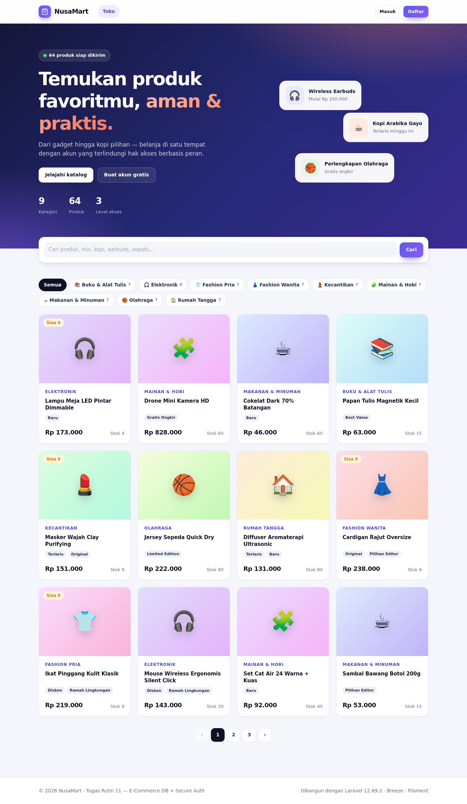

# NusaMart — Tugas Rutin 11: E-Commerce DB + Secure Auth

Laravel 12 · Breeze · Eloquent · Filament 4 · SQLite/MySQL



## Checklist requirement

| # | Requirement | Lokasi |
|---|-------------|--------|
| 1 | Migrations 7 tabel + FK constraints | `database/migrations` — `categories`, `products`, `orders`, `order_items`, `tags`, `product_tag`, kolom `role` di `users` (+ `posts`) |
| 2 | Seeders + factories, 50+ produk realistis | `DatabaseSeeder` (64 produk, 9 kategori, 10 tag), `ProductFactory` (katalog 72 produk nyata) |
| 3 | Model + relationships + ≥1 scope | `app/Models` — `Product::lowStock()`, `priceAbove()`, `inStock()` |
| 4 | Dokumentasi 5 query Tinker | [`docs/TINKER.md`](docs/TINKER.md) |
| 5 | Breeze (login/register/logout) | `routes/auth.php`, `app/Http/Controllers/Auth` |
| 6 | Multi-role + custom middleware | `RoleMiddleware` (alias `role:`) di `bootstrap/app.php` |
| 7 | PostPolicy edit/delete | `app/Policies/PostPolicy.php`, `PostController` |
| 8 | Route protection + uji 2 role | `routes/web.php`, `tests/Feature/RoleAccessTest.php` |
| ⭐ | Filament admin panel | `/admin` — CRUD produk, filter, widget statistik |
| ⭐ | Demo eager loading | `/demo/eager-loading` |

## Menjalankan

```bash
composer install && npm install
cp .env.example .env && php artisan key:generate
touch database/database.sqlite          # jika memakai SQLite (default)
php artisan migrate:fresh --seed
npm run build                           # atau npm run dev
php artisan serve
```

Seeder berjalan di SQLite **maupun** MySQL. Untuk MySQL (Laragon) ubah `DB_*` di `.env`.

> Tampilan memakai `public/css/shop.css` (CSS biasa, tanpa build). `npm run build` hanya diperlukan untuk Alpine.js.

## Akun demo (password: `password`)

| Role | Email | Akses |
|------|-------|-------|
| admin | admin@example.com | semua area, semua post, panel Filament |
| editor | editor@example.com | area editor, post **miliknya**, panel Filament |
| editor | editor2@example.com | editor kedua — untuk menguji PostPolicy |
| user | user@example.com | etalase, dashboard, profil |

## Skenario uji incognito (2 role)

Buka jendela normal (login **admin**) dan jendela Incognito (login **user**):

| URL | admin | editor | user | guest |
|-----|:----:|:----:|:----:|:----:|
| `/dashboard` | 200 | 200 | 200 | → login |
| `/editor-area`, `/posts`, `/demo/eager-loading` | 200 | 200 | **403** | → login |
| `/admin-area` | 200 | **403** | **403** | → login |
| `/admin` (Filament) | 200 | 200 | **403** | → login Filament |
| Edit/hapus post milik orang lain | ✅ | **403** | **403** | → login |

Otomatis: `php artisan test` (46 test, termasuk role, policy, Filament, seeder).

## Catatan keamanan
- `role` tidak bisa diisi saat registrasi (selalu `user`).
- Otorisasi per-record memakai `Gate::authorize` + `PostPolicy`; tombol di UI memakai `@can`.
- Panel Filament dibatasi lewat `User::canAccessPanel()` (admin & editor).
